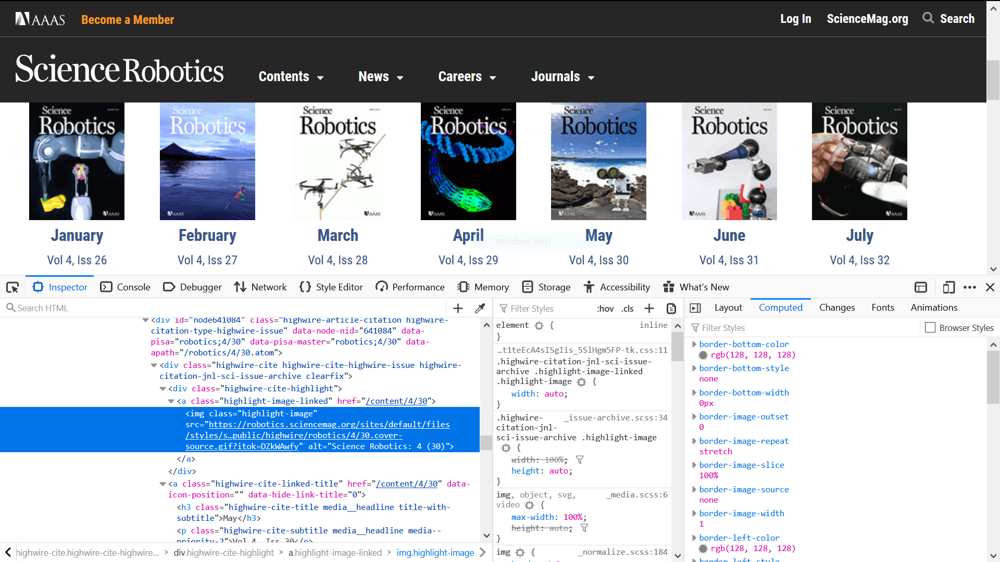

# `Scrapy` Notes

[TOC]

## Install `Scrapy`

To install this [package](https://anaconda.org/conda-forge/scrapy) with `conda` run one of the following:

```bash
conda install -c conda-forge scrapy
conda install -c conda-forge/label/cf201901 scrapy
```

But I get some problems by doing so. I don't know whether it is because I used to install `Anaconda` and `scrapy`, and uninstalled them later before. So I tried `pip install scrapy`, and it worked. Anyway, once you have installed `scrapy`, you can continue.

**It's worth noting that operations in this note are only tested on _Windows 10_. There might be a little bit different when comes with other platforms.**

## Architecture


A overview of the architecture of the `scrapy` should be very useful and helpful for a novice to begin with.

> 1. The [Engine](https://docs.scrapy.org/en/latest/topics/architecture.html#component-engine) gets the initial Requests to crawl from the [Spider](https://docs.scrapy.org/en/latest/topics/architecture.html#component-spiders).
> 2. The [Engine](https://docs.scrapy.org/en/latest/topics/architecture.html#component-engine) schedules the Requests in the [Scheduler](https://docs.scrapy.org/en/latest/topics/architecture.html#component-scheduler) and asks for the next Requests to crawl.
> 3. The [Scheduler](https://docs.scrapy.org/en/latest/topics/architecture.html#component-scheduler) returns the next Requests to the [Engine](https://docs.scrapy.org/en/latest/topics/architecture.html#component-engine).
> 4. The [Engine](https://docs.scrapy.org/en/latest/topics/architecture.html#component-engine) sends the Requests to the [Downloader](https://docs.scrapy.org/en/latest/topics/architecture.html#component-downloader), passing through the [Downloader Middlewares](https://docs.scrapy.org/en/latest/topics/architecture.html#component-downloader-middleware) (see [`process_request()`](https://docs.scrapy.org/en/latest/topics/downloader-middleware.html#scrapy.downloadermiddlewares.DownloaderMiddleware.process_request)).
> 5. Once the page finishes downloading the [Downloader](https://docs.scrapy.org/en/latest/topics/architecture.html#component-downloader) generates a Response (with that page) and sends it to the Engine, passing through the [Downloader Middlewares](https://docs.scrapy.org/en/latest/topics/architecture.html#component-downloader-middleware) (see [`process_response()`](https://docs.scrapy.org/en/latest/topics/downloader-middleware.html#scrapy.downloadermiddlewares.DownloaderMiddleware.process_response)).
> 6. The [Engine](https://docs.scrapy.org/en/latest/topics/architecture.html#component-engine) receives the Response from the [Downloader](https://docs.scrapy.org/en/latest/topics/architecture.html#component-downloader) and sends it to the [Spider](https://docs.scrapy.org/en/latest/topics/architecture.html#component-spiders) for processing, passing through the [Spider Middleware](https://docs.scrapy.org/en/latest/topics/architecture.html#component-spider-middleware) (see [`process_spider_input()`](https://docs.scrapy.org/en/latest/topics/spider-middleware.html#scrapy.spidermiddlewares.SpiderMiddleware.process_spider_input)).
> 7. The [Spider](https://docs.scrapy.org/en/latest/topics/architecture.html#component-spiders) processes the Response and returns scraped items and new Requests (to follow) to the [Engine](https://docs.scrapy.org/en/latest/topics/architecture.html#component-engine), passing through the [Spider Middleware](https://docs.scrapy.org/en/latest/topics/architecture.html#component-spider-middleware) (see [`process_spider_output()`](https://docs.scrapy.org/en/latest/topics/spider-middleware.html#scrapy.spidermiddlewares.SpiderMiddleware.process_spider_output)).
> 8. The [Engine](https://docs.scrapy.org/en/latest/topics/architecture.html#component-engine) sends processed items to [Item Pipelines](https://docs.scrapy.org/en/latest/topics/architecture.html#component-pipelines), then send processed Requests to the [Scheduler](https://docs.scrapy.org/en/latest/topics/architecture.html#component-scheduler) and asks for possible next Requests to crawl.
> 9. The process repeats (from step 1) until there are no more requests from the [Scheduler](https://docs.scrapy.org/en/latest/topics/architecture.html#component-scheduler).
>
> by `scrapy` documentation.

## A Prime Example

Here I will guide you how to build a typical `scrapy` project from scratch.

#### Create a new project

Under the folder where you want to create a project, execute `scrapy startproject <projectname> [project_dir]`.

eg. `scrapy startproject paper PaperDownload`

You will get a new folder named `PaperDownload` and `scrapy` will create some initial files for your project `paper`. The folder architecture is shown as follows. The comments show the function of each file.

```python
PaperDownload/
   scrapy.cfg            # deploy configuration file
   paper/                # project's Python module, you'll import your code from here
       __init__.py
       items.py          # project items definition file
       middlewares.py    # project middlewares file
       pipelines.py      # project pipelines file
       settings.py       # project settings file
       spiders/          # a directory where you'll later put your spiders
           __init__.py
```

Generally speaking, you put your code in `spiders/` folder. Other module such as `Item`, `Pipeline`, `middleware` are not needed for new beginners. In this notes, I will modify some of these modules. **In this process, you should keep the framework of `scrapy` in mind to fully understand what's going on in the project.**

For more information of what these files are used for, please refer to this [link](https://docs.scrapy.org/en/latest/intro/tutorial.html#creating-a-project).

#### Generate your spider

Enter the project folder by `cd PaperDownload`

Generally speaking, you can create a spider by command line or manually.

1. command line

`scrapy genspider [options] name domain.com`

eg. `scrapy genspider scirob robotics.sciencemag.org`

This command will create a file `scirob.py` in the `spiders` folder, with following contents:

```python
# -*- coding: utf-8 -*-
import scrapy


class ScirobSpider(scrapy.Spider):
    name = 'scirob'
    allowed_domains = ['robotics.sciencemag.org']
    start_urls = ['http://robotics.sciencemag.org/']

    def parse(self, response):
        pass
```

2. manually

Create a `.py` file in the `spiders` folder. And write your spider manually.

Both ways are fine.

Suppose you have choose the first way, and you got the `scirob.py` file and there were some default content inside.

The created file contains the definition of a spider, whose name is `scirob`, defined in the attribute `name`. The name of the spider will be used in the command line to run the spider. In addition, `allowed_domains` defines the domain this spider is allowed to access. `start_urls` define the list which contains the initial URL nodes.

Function `parse` define the callback function when responses of URLs in `start_urls` are available.

**And requests yielded in the parse function will be processed later in the corresponding callback function.** This is the default behavior of a scrapy spider, and it can be custom-designed.

#### Analyze spider logic

First we visit the website of _Science Robotics_, analyze the structure of the website.

It's obvious that papers of _Science Robotics_ are arranged in issues. Papers in one year are arranged in one volume, and every month there is an issue. You can link to all the issues in the _Archives_. So a natural solution is, first visit the archives, then extract the issue links, jump to the issue page, last obtain the pdf link in the issue page.


The _Archives_ have a separate page for each year, from 2016 to 2019. Their addresses are similar with a common pattern `https://robotics.sciencemag.org/content/by/year/year_no`, where `year_no` can be 2016, 2017, 2018 and 2019. These URLs will be the initial network nodes the spider is going to visit.

#### Implement your spider step by step

This will be a tough journey, and I will try my best to make it simple and easy to understand.

According to the analysis above, we have decided the beginning URLs. To make your spider starting from these URLs, you just simply assign the `start_urls` attribute of the spider.

```python
start_urls = ['https://robotics.sciencemag.org/content/by/year/2016','https://robotics.sciencemag.org/content/by/year/2017','https://robotics.sciencemag.org/content/by/year/2018','https://robotics.sciencemag.org/content/by/year/2019']
```

However, in order to make the spider more intelligent and scalable, two variables are defined to automatically generate the range of years the spider is going to crawl, which indicate that you can change the range of years to be crawled simply by change these two variables. `Scrapy` provides a method named `start_requests` to custom define the initial requests.

```python
class ScirobSpider(scrapy.Spider):
    name = 'scirob'
    base_url = "https://robotics.sciencemag.org/content/by/year/"
    start_year = 2016
    current_year = 2019
    def start_requests(self):
        year_range = range(self.start_year, self.current_year + 1)
        for year in year_range:
            # generate the url for archive page of each year
            url = self.base_url + str(year)
            self.log(url)
            # request the archive page
            yield scrapy.Request(url, callback=self.parse_issue)
```

Now, you have told the framework the initial network nodes (URLs) we want to crawl, which correspond to the **step 1** in the framework architecture. The framework will handle the following step 2, 3, 4, 5, 6 for you if you haven't self-defined the middleware modules. In fact, in this simple demonstration, you don't need to change the behavior of the middleware modules, so just let the framework handle all other things for you.

###### Response Analysis

After the response are obtained from the internet, the framework will encapsulate the result into a response object and pass it to corresponding callback function to analyzed it. For the initial responses, the callback function are `parse_issue` function, which is defined in the declaration when the `Request` are yielded. So we will write our own process function now. Following is a simple demo of a callback function:

```python
# extract the url for each issue and request them
def parse_issue(self, response):
  pass
```

The `Response` object are passed to the function as an argument. But it does nothing. In order to make it do something, you need use a tool called regular expression. For simplicity, `Reponse` object have provided a lot of methods for you to get its content, which make you needn't to learn RE at all.

In the analysis of text content, regular expression comes the first head. You can use the internal regular expression engine in python to parse the text content. In the case, we are going to take the advantage of the CSS selector parse engine provided in scrapy, which is based on `xpath`. It's more convenient and easy to be comprehended.

You simple invoke the `css` method of a `Response` object. Some examples are listed here:

```python
response.css('title') # return all title tags in the source code
response.css('title::text').getall() # return the inner text in the title tags in the form of a list
response.css('title::text').get() # return the inner text in the first title tag
response.css('title::text').re(r'Quotes.*') # parse the result with regular expression
response.css('li.next a::attr(href)').get() # get href attribute
response.css('li.next a').attrib['href']
```

Ok, now we are going to parse the links which represents every issue of `Sci Rob`.



Open the development console by press `F12`, locating the element which contain the links you need using inspector. The element will be highlighted, and that's exactly what you need. Like the source code above, it is `<a class="hightlight-image" href="/content/4/30">...`, note that it's not the `` tag. So we write a CSS selector to obtain the link.

```python
highlight_image_links = response.css("a.highlight-image-linked")
```

It returns a list which contain all the `<a>` tag whose class is `highlight-image-linked` in this page. To tell the architecture where to crawl in the next step, you even need not to parse the URL yourself. You can directly pass the `<a>` element to the `Response` constructor.

```python
for tag_a in highlight_image_links:
  yield response.follow(tag_a, callback=self.parse_pdf)
```

So here is your `pass_issue` function.

```python
# extract the url for each issue and request them
def parse_issue(self, response):
  highlight_image_links = response.css("a.highlight-image-linked")
  for tag_a in highlight_image_links:
    yield response.follow(tag_a, callback=self.parse_pdf)
```

Now we have process the response page from initial network page and yield new requests to the real page where pdfs are located. If you are smart enough, you must have noticed that we have defined callback function in their requests, i. e. `parse_pdf`.

Same routine, we parse the pdf links and yield them.


```python
def parse_pdf(self, response):
  tag_ul = response.css("ul.issue-toc.item-list")
  tags_a = tag_ul.css(
    "a.highwire-variant-link.variant-full-textpdf.link-icon")
  pdf_urls = []
  for tag_a in tags_a:
    pdf_url = response.urljoin(tag_a.css("a::attr(href)").get())
    # in fact, there is a url redirection here, autohandled by scrapy
    pdf_urls.append(pdf_url)
```

###### Items

In this callback function, we can obtain all the pdf links in one issue. Now we have to consider how to download them. Generally speaking, you can do them all by manually, it is too stupid. The reason why we use the framework, because they can save time for us. In fact, scrapy also provide a file downloader for us. In this tutorial, we are going to use the internal downloader to simplify the process.

In order to use the downloader in scrapy, first you should add an item definition in the the `items.py`.

```python
from scrapy import Item
from scrapy.item import Field

class SciRobIssueItem(Item):
    volume = Field()
    issue = Field()
    # contain the urls of pdf
    file_urls = Field()
    # will be populated automatically after downloading
    files = Field()
```

So what's the usage of this `Item`: contain all the information you should provided scrapy to let it know where to download and additional information. Here we add two additional information for later saving of the pdf files. Then what you should do is yield these items in your parse function, i. e. `parse_pdf`.

```python
from paper.items import SciRobIssueItem

# extract all urls for pdfs in the issue and store them in the item
def parse_pdf(self, response):
  # extract the volume and issue
  current_url = response.url
  volume = int(current_url.split("/")[-2])
  issue = int(current_url.split("/")[-1])
  # extract urls of all pdf and store them in the item
  issue = SciRobIssueItem(volume=volume, issue=issue)
  tag_ul = response.css("ul.issue-toc.item-list")
  tags_a = tag_ul.css(
    "a.highwire-variant-link.variant-full-textpdf.link-icon")
  pdf_urls = []
  for tag_a in tags_a:
    pdf_url = response.urljoin(tag_a.css("a::attr(href)").get())
    # in fact, there is a url redirection here, autohandled by scrapy
    pdf_urls.append(pdf_url)
    issue["file_urls"] = pdf_urls
    # return the extracted data for pipeline for postprocessing
    yield issue
```

This should be very easy to understand. I extract the volume number, issue number and pdf links from the issue page and store them into an `SciRobIssueItem` object and yield it. The meaning of yielding an `Item` is the same as yielding a `Request`, the difference lies in the process of the scrapy engine. According to the architecture of scrapy, the engine will pass the item to the `Item Pipelines`. That's where we will going to post-process the yielded `Item`.

###### FilesPipeline

Like `Request` object who must have a callback function when yielded, the `Item` object also need a `Pipeline` object to do the control the processing of downloading the files. You can set the `ITEM_PIPELINES` in the `settings.py` but it will take effect in the project scope. We recommend setting it in the spider file, which just take effect in the spider scope.

```python
custom_settings = {
  "DOWNLOAD_TIMEOUT": 300,
  # set the SciRobPdfsPipeline to the first handling pipeline when items are passed to the pipelines
  "ITEM_PIPELINES": {
    'paper.pipelines.SciRobPdfsPipeline': 1
  },
  'MEDIA_ALLOW_REDIRECTS': True,
  'FILES_STORE': "Downloads",  # define where to store the files
  'FILES_EXPIRES': 120,
}
```

The setting are self-clear enough. And I just explain one of them: `MEDIA_ALLOW_REDIRECTS`. In fact the pdf links parsed in the issue are not the real link of the pdf resource, it's a convention to protect the online resources. By setting this configuration to true, scrapy will try to auto redirect to the real address where the resources are and download them.

Now, we get to the `pipelines.py` to write our pipeline, very similar to callback function, right?

```python
import scrapy
from scrapy.pipelines.files import FilesPipeline

class SciRobPdfsPipeline(FilesPipeline):
    def get_media_requests(self, item, info):
        # get the index of pdf according to the position of url in the file_urls
        volume = item.get("volume", "NA")
        issue = item.get("issue", "NA")
        return [
            scrapy.Request(x,
                           meta={
                               "volume": volume,
                               "issue": issue,
                               "index": index + 1
                           })
            for index, x in enumerate(item.get(self.files_urls_field, []))
        ]
```

In `get_media_request` method you can made some modifications before the requests to download the files are submitted to the scrapy framework.

In order to better save the pdf files, I add some information in the `Request` object, including the volume number, issue number and the index of this pdf in one issue. Here we use a grammer like `[x*2 for x in rang(10)]` in python, making the code more brief. You also can write a `for` loop.

After rewrite the `get_media_request` method, the `Request` will be submitted to scrapy framework to download the file resource. A following question is how to store them. In fact we have specify the store folder in the settings in spider file. But how about the filename?

A better practice will be store the pdfs of one issue in one folder named by the issue number and every pdf are arranged in the order appeared on the website. That's where the additional information we add to the `Request` object make significance.

`scrapy` also provides a `file_path` in the `FilesPipeline` to allow users to self-define the filename. So what we should do is fetch the information we add into the `Request` object and concatenate the folder and filename we want.

```python
import os
from urllib.parse import urlparse

def file_path(self, request, response=None, info=None):
  volume = request.meta.get("volume")
  issue = request.meta.get("issue")
  index = request.meta.get("index")
  # By default the file_path() method returns full/<request URL hash>.<extension>.
  # change the default path
  filename = ("[" + str(index) + "] " +
              os.path.basename(urlparse(request.url).path))
  return "Volume %s Issue %s/%s" % (volume, issue, filename)
```

By now, we have finished the coding of this spider, it should work.

###### Some trivial settings

It's worthy to mention, it's a common practice to make some modifications in the `settings.py`. That is:

```python
USER_AGENT = 'Mozilla/5.0 (Windows NT 10.0; Win64; x64; rv:72.0) Gecko/20100101 Firefox/72.0'
ROBOTSTXT_OBEY = False
```

In the end, your source code file should look like this:

```python
# -*- coding: utf-8 -*-

# Define your item pipelines here
#
# Don't forget to add your pipeline to the ITEM_PIPELINES setting
# See: https://docs.scrapy.org/en/latest/topics/item-pipeline.html

# scirob.py

import scrapy
from scrapy.pipelines.files import FilesPipeline
import os
from urllib.parse import urlparse


class PaperPipeline(object):
    def process_item(self, item, spider):
        return item


class SciRobPdfsPipeline(FilesPipeline):
    def file_path(self, request, response=None, info=None):
        volume = request.meta.get("volume")
        issue = request.meta.get("issue")
        index = request.meta.get("index")
        # By default the file_path() method returns full/<request URL hash>.<extension>.
        # change the default path
        filename = ("[" + str(index) + "] " +
                    os.path.basename(urlparse(request.url).path))
        return "Volume %s Issue %s/%s" % (volume, issue, filename)

    def get_media_requests(self, item, info):
        # get the index of pdf according to the position of url in the file_urls
        volume = item.get("volume", "NA")
        issue = item.get("issue", "NA")
        return [
            scrapy.Request(x,
                           meta={
                               "volume": volume,
                               "issue": issue,
                               "index": index + 1
                           })
            for index, x in enumerate(item.get(self.files_urls_field, []))
        ]
```

```python
# -*- coding: utf-8 -*-

# Define here the models for your scraped items
#
# See documentation in:
# https://docs.scrapy.org/en/latest/topics/items.html

# items.py

import scrapy
from scrapy import Item
from scrapy.item import Field


class PaperItem(scrapy.Item):
    # define the fields for your item here like:
    # name = scrapy.Field()
    pass


class SciRobIssueItem(Item):
    volume = Field()
    issue = Field()
    # contain the urls of pdf
    file_urls = Field()
    # will be populated automatically after downloading
    files = Field()
```

```python
# -*- coding: utf-8 -*-

# Define your item pipelines here
#
# Don't forget to add your pipeline to the ITEM_PIPELINES setting
# See: https://docs.scrapy.org/en/latest/topics/item-pipeline.html

# pipelines.py

import scrapy
from scrapy.pipelines.files import FilesPipeline
import os
from urllib.parse import urlparse


class PaperPipeline(object):
    def process_item(self, item, spider):
        return item


class SciRobPdfsPipeline(FilesPipeline):
    def file_path(self, request, response=None, info=None):
        volume = request.meta.get("volume")
        issue = request.meta.get("issue")
        index = request.meta.get("index")
        # By default the file_path() method returns full/<request URL hash>.<extension>.
        # change the default path
        filename = ("[" + str(index) + "] " +
                    os.path.basename(urlparse(request.url).path))
        return "Volume %s Issue %s/%s" % (volume, issue, filename)

    def get_media_requests(self, item, info):
        # get the index of pdf according to the position of url in the file_urls
        volume = item.get("volume", "NA")
        issue = item.get("issue", "NA")
        return [
            scrapy.Request(x,
                           meta={
                               "volume": volume,
                               "issue": issue,
                               "index": index + 1
                           })
            for index, x in enumerate(item.get(self.files_urls_field, []))
        ]
```

###### Run your spider

Now run your spider by command: `scrapy crawl scirob` in the project folder. Something like this will shown in your console:

```
2020-03-07 13:49:28 [scrapy.utils.log] INFO: Scrapy 1.8.0 started (bot: paper)
2020-03-07 13:49:28 [scrapy.utils.log] INFO: Versions: lxml 4.4.1.0, libxml2 2.9.9, cssselect 1.1.0, parsel 1.5.2, w3lib 1.21.0, Twisted 19.10.0, Python 3.7.4 (default, Aug  9 2019, 18:34:13) [MSC v.1915 64 bit (AMD64)], pyOpenSSL 19.0.0 (OpenSSL 1.1.1d  10 Sep 2019), cryptography 2.7, Platform Windows-10-10.0.18362-SP0
2020-03-07 13:49:28 [scrapy.crawler] INFO: Overridden settings: {'BOT_NAME': 'paper', 'DOWNLOAD_TIMEOUT': 300, 'NEWSPIDER_MODULE': 'paper.spiders', 'SPIDER_MODULES': ['paper.spiders'], 'USER_AGENT': 'Mozilla/5.0 (Windows NT 10.0; Win64; x64; rv:72.0) Gecko/20100101 Firefox/72.0'}
2020-03-07 13:49:28 [scrapy.extensions.telnet] INFO: Telnet Password: 33b192ac6633f12d
2020-03-07 13:49:28 [scrapy.middleware] INFO: Enabled extensions:
['scrapy.extensions.corestats.CoreStats',
 'scrapy.extensions.telnet.TelnetConsole',
 'scrapy.extensions.logstats.LogStats']
2020-03-07 13:49:28 [scrapy.middleware] INFO: Enabled downloader middlewares:
['scrapy.downloadermiddlewares.httpauth.HttpAuthMiddleware',
 'scrapy.downloadermiddlewares.downloadtimeout.DownloadTimeoutMiddleware',
 'scrapy.downloadermiddlewares.defaultheaders.DefaultHeadersMiddleware',
 'scrapy.downloadermiddlewares.useragent.UserAgentMiddleware',
 'scrapy.downloadermiddlewares.retry.RetryMiddleware',
 'scrapy.downloadermiddlewares.redirect.MetaRefreshMiddleware',
 'scrapy.downloadermiddlewares.httpcompression.HttpCompressionMiddleware',
 'scrapy.downloadermiddlewares.redirect.RedirectMiddleware',
 'scrapy.downloadermiddlewares.cookies.CookiesMiddleware',
 'scrapy.downloadermiddlewares.httpproxy.HttpProxyMiddleware',
 'scrapy.downloadermiddlewares.stats.DownloaderStats']
2020-03-07 13:49:28 [scrapy.middleware] INFO: Enabled spider middlewares:
['scrapy.spidermiddlewares.httperror.HttpErrorMiddleware',
 'scrapy.spidermiddlewares.offsite.OffsiteMiddleware',
 'scrapy.spidermiddlewares.referer.RefererMiddleware',
 'scrapy.spidermiddlewares.urllength.UrlLengthMiddleware',
 'scrapy.spidermiddlewares.depth.DepthMiddleware']
2020-03-07 13:49:28 [scrapy.middleware] INFO: Enabled item pipelines:
['paper.pipelines.SciRobPdfsPipeline']
2020-03-07 13:49:28 [scrapy.core.engine] INFO: Spider opened
2020-03-07 13:49:28 [scrapy.extensions.logstats] INFO: Crawled 0 pages (at 0 pages/min), scraped 0 items (at 0 items/min)
2020-03-07 13:49:28 [scrapy.extensions.telnet] INFO: Telnet console listening on 127.0.0.1:6023
2020-03-07 13:49:28 [scirob] DEBUG: https://robotics.sciencemag.org/content/by/year/2016
2020-03-07 13:49:31 [scrapy.core.engine] DEBUG: Crawled (200) <GET https://robotics.sciencemag.org/content/by/year/2016> (referer: None)
2020-03-07 13:49:32 [scrapy.core.engine] DEBUG: Crawled (200) <GET https://robotics.sciencemag.org/content/1/1> (referer: https://robotics.sciencemag.org/content/by/year/2016)
2020-03-07 13:49:32 [scrapy.downloadermiddlewares.redirect] DEBUG: Redirecting (301) to <GET https://robotics.sciencemag.org/content/robotics/1/1/eaal2099.full.pdf> from <GET https://robotics.sciencemag.org/content/1/1/eaal2099.full.pdf>
2020-03-07 13:49:33 [scrapy.downloadermiddlewares.redirect] DEBUG: Redirecting (301) to <GET https://robotics.sciencemag.org/content/robotics/1/1/eaag2048.full.pdf> from <GET https://robotics.sciencemag.org/content/1/1/eaag2048.full.pdf>
2020-03-07 13:49:33 [scrapy.downloadermiddlewares.redirect] DEBUG: Redirecting (301) to <GET https://robotics.sciencemag.org/content/robotics/1/1/eaah3690.full.pdf> from <GET https://robotics.sciencemag.org/content/1/1/eaah3690.full.pdf>
2020-03-07 13:49:33 [scrapy.downloadermiddlewares.redirect] DEBUG: Redirecting (301) to <GET https://robotics.sciencemag.org/content/robotics/1/1/eaag3296.full.pdf> from <GET https://robotics.sciencemag.org/content/1/1/eaag3296.full.pdf>
2020-03-07 13:49:33 [scrapy.downloadermiddlewares.redirect] DEBUG: Redirecting (301) to <GET https://robotics.sciencemag.org/content/robotics/1/1/eaai7529.full.pdf> from <GET https://robotics.sciencemag.org/content/1/1/eaai7529.full.pdf>
2020-03-07 13:49:33 [scrapy.downloadermiddlewares.redirect] DEBUG: Redirecting (301) to <GET https://robotics.sciencemag.org/content/robotics/1/1/eaah5682.full.pdf> from <GET https://robotics.sciencemag.org/content/1/1/eaah5682.full.pdf>
2020-03-07 13:49:54 [scrapy.core.engine] DEBUG: Crawled (200) <GET https://robotics.sciencemag.org/content/robotics/1/1/eaag3296.full.pdf> (referer: None)
2020-03-07 13:49:54 [scrapy.pipelines.files] DEBUG: File (downloaded): Downloaded file from <GET https://robotics.sciencemag.org/content/1/1/eaag3296.full.pdf> referred in <None>
2020-03-07 13:50:25 [scrapy.core.engine] DEBUG: Crawled (200) <GET https://robotics.sciencemag.org/content/robotics/1/1/eaah5682.full.pdf> (referer: None)
2020-03-07 13:50:25 [scrapy.pipelines.files] DEBUG: File (downloaded): Downloaded file from <GET https://robotics.sciencemag.org/content/1/1/eaah5682.full.pdf> referred in <None>
2020-03-07 13:50:28 [scrapy.extensions.logstats] INFO: Crawled 4 pages (at 4 pages/min), scraped 0 items (at 0 items/min)
2020-03-07 13:50:35 [scrapy.core.engine] DEBUG: Crawled (200) <GET https://robotics.sciencemag.org/content/robotics/1/1/eaag2048.full.pdf> (referer: None)
2020-03-07 13:50:35 [scrapy.pipelines.files] DEBUG: File (downloaded): Downloaded file from <GET https://robotics.sciencemag.org/content/1/1/eaag2048.full.pdf> referred in <None>
2020-03-07 13:51:21 [scrapy.core.engine] DEBUG: Crawled (200) <GET https://robotics.sciencemag.org/content/robotics/1/1/eaal2099.full.pdf> (referer: None)
2020-03-07 13:51:21 [scrapy.pipelines.files] DEBUG: File (downloaded): Downloaded file from <GET https://robotics.sciencemag.org/content/1/1/eaal2099.full.pdf> referred in <None>
2020-03-07 13:51:21 [scrapy.core.scraper] DEBUG: Scraped from <200 https://robotics.sciencemag.org/content/1/1>
{'file_urls': ['https://robotics.sciencemag.org/content/1/1/eaal2099.full.pdf',
               'https://robotics.sciencemag.org/content/1/1/eaah3690.full.pdf',
               'https://robotics.sciencemag.org/content/1/1/eaai7529.full.pdf',
               'https://robotics.sciencemag.org/content/1/1/eaag2048.full.pdf',
               'https://robotics.sciencemag.org/content/1/1/eaag3296.full.pdf',
               'https://robotics.sciencemag.org/content/1/1/eaah5682.full.pdf'],
 'files': [{'checksum': 'c3135a2878689645532c2915905b1047',
            'path': 'Volume 1 Issue 1/[1] eaal2099.full.pdf',
            'url': 'https://robotics.sciencemag.org/content/1/1/eaal2099.full.pdf'}],
 'issue': 1,
 'volume': 1}
2020-03-07 13:51:28 [scrapy.extensions.logstats] INFO: Crawled 6 pages (at 2 pages/min), scraped 1 items (at 1 items/min)
2020-03-07 13:52:28 [scrapy.extensions.logstats] INFO: Crawled 6 pages (at 0 pages/min), scraped 1 items (at 0 items/min)
2020-03-07 13:53:12 [scrapy.core.engine] DEBUG: Crawled (200) <GET https://robotics.sciencemag.org/content/robotics/1/1/eaai7529.full.pdf> (referer: None)
2020-03-07 13:53:12 [scrapy.pipelines.files] DEBUG: File (downloaded): Downloaded file from <GET https://robotics.sciencemag.org/content/1/1/eaai7529.full.pdf> referred in <None>
2020-03-07 13:53:18 [scrapy.core.engine] DEBUG: Crawled (200) <GET https://robotics.sciencemag.org/content/robotics/1/1/eaah3690.full.pdf> (referer: None)
2020-03-07 13:53:18 [scrapy.pipelines.files] DEBUG: File (downloaded): Downloaded file from <GET https://robotics.sciencemag.org/content/1/1/eaah3690.full.pdf> referred in <None>
2020-03-07 13:53:18 [scrapy.core.scraper] DEBUG: Scraped from <200 https://robotics.sciencemag.org/content/1/1>
{'file_urls': ['https://robotics.sciencemag.org/content/1/1/eaal2099.full.pdf',
               'https://robotics.sciencemag.org/content/1/1/eaah3690.full.pdf',
               'https://robotics.sciencemag.org/content/1/1/eaai7529.full.pdf',
               'https://robotics.sciencemag.org/content/1/1/eaag2048.full.pdf',
               'https://robotics.sciencemag.org/content/1/1/eaag3296.full.pdf',
               'https://robotics.sciencemag.org/content/1/1/eaah5682.full.pdf'],
 'files': [{'checksum': 'c3135a2878689645532c2915905b1047',
            'path': 'Volume 1 Issue 1/[1] eaal2099.full.pdf',
            'url': 'https://robotics.sciencemag.org/content/1/1/eaal2099.full.pdf'},
           {'checksum': 'cb0eb81f03effe1a5b396fd624e198b4',
            'path': 'Volume 1 Issue 1/[2] eaah3690.full.pdf',
            'url': 'https://robotics.sciencemag.org/content/1/1/eaah3690.full.pdf'}],
 'issue': 1,
 'volume': 1}
2020-03-07 13:53:18 [scrapy.core.scraper] DEBUG: Scraped from <200 https://robotics.sciencemag.org/content/1/1>
{'file_urls': ['https://robotics.sciencemag.org/content/1/1/eaal2099.full.pdf',
               'https://robotics.sciencemag.org/content/1/1/eaah3690.full.pdf',
               'https://robotics.sciencemag.org/content/1/1/eaai7529.full.pdf',
               'https://robotics.sciencemag.org/content/1/1/eaag2048.full.pdf',
               'https://robotics.sciencemag.org/content/1/1/eaag3296.full.pdf',
               'https://robotics.sciencemag.org/content/1/1/eaah5682.full.pdf'],
 'files': [{'checksum': 'c3135a2878689645532c2915905b1047',
            'path': 'Volume 1 Issue 1/[1] eaal2099.full.pdf',
            'url': 'https://robotics.sciencemag.org/content/1/1/eaal2099.full.pdf'},
           {'checksum': 'cb0eb81f03effe1a5b396fd624e198b4',
            'path': 'Volume 1 Issue 1/[2] eaah3690.full.pdf',
            'url': 'https://robotics.sciencemag.org/content/1/1/eaah3690.full.pdf'},
           {'checksum': '5ed5d4237a94f0e32986608e6472537b',
            'path': 'Volume 1 Issue 1/[3] eaai7529.full.pdf',
            'url': 'https://robotics.sciencemag.org/content/1/1/eaai7529.full.pdf'},
           {'checksum': 'ff300061538b89db02db4f0a1296de83',
            'path': 'Volume 1 Issue 1/[4] eaag2048.full.pdf',
            'url': 'https://robotics.sciencemag.org/content/1/1/eaag2048.full.pdf'},
           {'checksum': '8206a6e0133f924244a164b0fc8825c8',
            'path': 'Volume 1 Issue 1/[5] eaag3296.full.pdf',
            'url': 'https://robotics.sciencemag.org/content/1/1/eaag3296.full.pdf'}],
 'issue': 1,
 'volume': 1}
2020-03-07 13:53:18 [scrapy.core.scraper] DEBUG: Scraped from <200 https://robotics.sciencemag.org/content/1/1>
{'file_urls': ['https://robotics.sciencemag.org/content/1/1/eaal2099.full.pdf',
               'https://robotics.sciencemag.org/content/1/1/eaah3690.full.pdf',
               'https://robotics.sciencemag.org/content/1/1/eaai7529.full.pdf',
               'https://robotics.sciencemag.org/content/1/1/eaag2048.full.pdf',
               'https://robotics.sciencemag.org/content/1/1/eaag3296.full.pdf',
               'https://robotics.sciencemag.org/content/1/1/eaah5682.full.pdf'],
 'files': [{'checksum': 'c3135a2878689645532c2915905b1047',
            'path': 'Volume 1 Issue 1/[1] eaal2099.full.pdf',
            'url': 'https://robotics.sciencemag.org/content/1/1/eaal2099.full.pdf'},
           {'checksum': 'cb0eb81f03effe1a5b396fd624e198b4',
            'path': 'Volume 1 Issue 1/[2] eaah3690.full.pdf',
            'url': 'https://robotics.sciencemag.org/content/1/1/eaah3690.full.pdf'},
           {'checksum': '5ed5d4237a94f0e32986608e6472537b',
            'path': 'Volume 1 Issue 1/[3] eaai7529.full.pdf',
            'url': 'https://robotics.sciencemag.org/content/1/1/eaai7529.full.pdf'},
           {'checksum': 'ff300061538b89db02db4f0a1296de83',
            'path': 'Volume 1 Issue 1/[4] eaag2048.full.pdf',
            'url': 'https://robotics.sciencemag.org/content/1/1/eaag2048.full.pdf'},
           {'checksum': '8206a6e0133f924244a164b0fc8825c8',
            'path': 'Volume 1 Issue 1/[5] eaag3296.full.pdf',
            'url': 'https://robotics.sciencemag.org/content/1/1/eaag3296.full.pdf'},
           {'checksum': 'bc00d1c4749e0b31623ad353cf214fb6',
            'path': 'Volume 1 Issue 1/[6] eaah5682.full.pdf',
            'url': 'https://robotics.sciencemag.org/content/1/1/eaah5682.full.pdf'}],
 'issue': 1,
 'volume': 1}
2020-03-07 13:53:18 [scrapy.core.scraper] DEBUG: Scraped from <200 https://robotics.sciencemag.org/content/1/1>
{'file_urls': ['https://robotics.sciencemag.org/content/1/1/eaal2099.full.pdf',
               'https://robotics.sciencemag.org/content/1/1/eaah3690.full.pdf',
               'https://robotics.sciencemag.org/content/1/1/eaai7529.full.pdf',
               'https://robotics.sciencemag.org/content/1/1/eaag2048.full.pdf',
               'https://robotics.sciencemag.org/content/1/1/eaag3296.full.pdf',
               'https://robotics.sciencemag.org/content/1/1/eaah5682.full.pdf'],
 'files': [{'checksum': 'c3135a2878689645532c2915905b1047',
            'path': 'Volume 1 Issue 1/[1] eaal2099.full.pdf',
            'url': 'https://robotics.sciencemag.org/content/1/1/eaal2099.full.pdf'},
           {'checksum': 'cb0eb81f03effe1a5b396fd624e198b4',
            'path': 'Volume 1 Issue 1/[2] eaah3690.full.pdf',
            'url': 'https://robotics.sciencemag.org/content/1/1/eaah3690.full.pdf'},
           {'checksum': '5ed5d4237a94f0e32986608e6472537b',
            'path': 'Volume 1 Issue 1/[3] eaai7529.full.pdf',
            'url': 'https://robotics.sciencemag.org/content/1/1/eaai7529.full.pdf'}],
 'issue': 1,
 'volume': 1}
2020-03-07 13:53:18 [scrapy.core.scraper] DEBUG: Scraped from <200 https://robotics.sciencemag.org/content/1/1>
{'file_urls': ['https://robotics.sciencemag.org/content/1/1/eaal2099.full.pdf',
               'https://robotics.sciencemag.org/content/1/1/eaah3690.full.pdf',
               'https://robotics.sciencemag.org/content/1/1/eaai7529.full.pdf',
               'https://robotics.sciencemag.org/content/1/1/eaag2048.full.pdf',
               'https://robotics.sciencemag.org/content/1/1/eaag3296.full.pdf',
               'https://robotics.sciencemag.org/content/1/1/eaah5682.full.pdf'],
 'files': [{'checksum': 'c3135a2878689645532c2915905b1047',
            'path': 'Volume 1 Issue 1/[1] eaal2099.full.pdf',
            'url': 'https://robotics.sciencemag.org/content/1/1/eaal2099.full.pdf'},
           {'checksum': 'cb0eb81f03effe1a5b396fd624e198b4',
            'path': 'Volume 1 Issue 1/[2] eaah3690.full.pdf',
            'url': 'https://robotics.sciencemag.org/content/1/1/eaah3690.full.pdf'},
           {'checksum': '5ed5d4237a94f0e32986608e6472537b',
            'path': 'Volume 1 Issue 1/[3] eaai7529.full.pdf',
            'url': 'https://robotics.sciencemag.org/content/1/1/eaai7529.full.pdf'},
           {'checksum': 'ff300061538b89db02db4f0a1296de83',
            'path': 'Volume 1 Issue 1/[4] eaag2048.full.pdf',
            'url': 'https://robotics.sciencemag.org/content/1/1/eaag2048.full.pdf'}],
 'issue': 1,
 'volume': 1}
2020-03-07 13:53:18 [scrapy.core.engine] INFO: Closing spider (finished)
2020-03-07 13:53:18 [scrapy.statscollectors] INFO: Dumping Scrapy stats:
{'downloader/request_bytes': 16544,
 'downloader/request_count': 14,
 'downloader/request_method_count/GET': 14,
 'downloader/response_bytes': 25699149,
 'downloader/response_count': 14,
 'downloader/response_status_count/200': 8,
 'downloader/response_status_count/301': 6,
 'elapsed_time_seconds': 230.165172,
 'file_count': 6,
 'file_status_count/downloaded': 6,
 'finish_reason': 'finished',
 'finish_time': datetime.datetime(2020, 3, 7, 5, 53, 18, 984824),
 'item_scraped_count': 6,
 'log_count/DEBUG': 27,
 'log_count/INFO': 13,
 'request_depth_max': 1,
 'response_received_count': 8,
 'scheduler/dequeued': 2,
 'scheduler/dequeued/memory': 2,
 'scheduler/enqueued': 2,
 'scheduler/enqueued/memory': 2,
 'start_time': datetime.datetime(2020, 3, 7, 5, 49, 28, 819652)}
2020-03-07 13:53:18 [scrapy.core.engine] INFO: Spider closed (finished)
```

It's the log information when the framework are running. If your IP address have the access to the Sci Robt papers and web connection are fast enough, you should finish downloading them in about 5mins, which is time cost when I test it with my college IP.

## END

Congratulations! You have experienced some awesome feature scrapy framework provide you. If you want to learn more, you can find more information at its [website](https://scrapy.org/).
